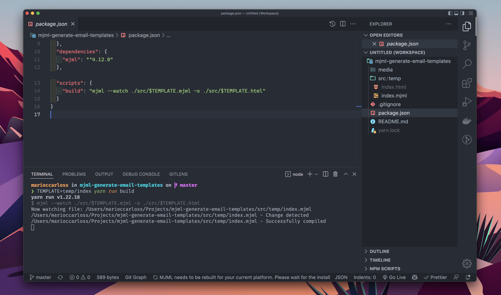
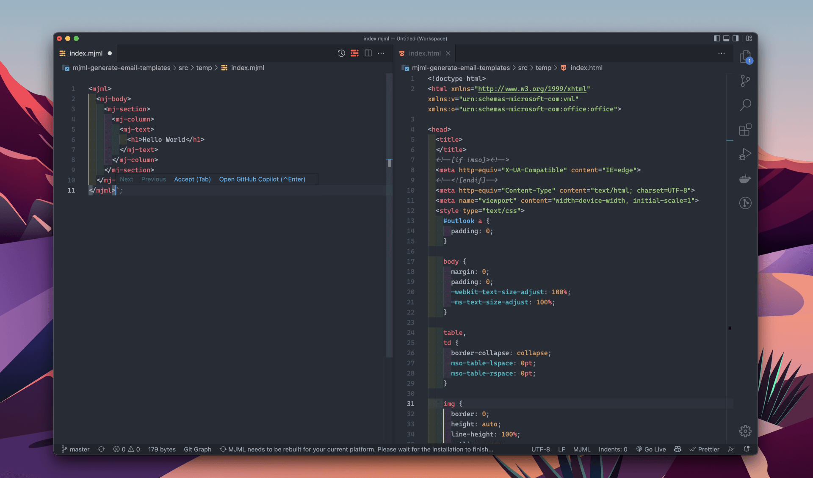

## Generate Email Template with mjml

This is a basic app to manage email templates using [mjml](https://mjml.io).

### Installation

After clone repo, run:

```bash
  yarn add mjml
```

### Usage

You can manage dynamically your email templates with mjml using environment variables.

```json
  {
    ...
    "scripts": {
      "build": "mjml --watch ./src/$TEMPLATE.mjml -o ./src/$TEMPLATE.html"
    }
  }
```

You run the app with environment variable declaration in scripts of package.json and then complete using yarn run build.

```bash
  TEMPLATE=temp/index yarn run build
```

In this case, the name of the environment variable is TEMPLATE, you can modify it in the script, same the name of email path.



Finally you will get the email template in html format.

